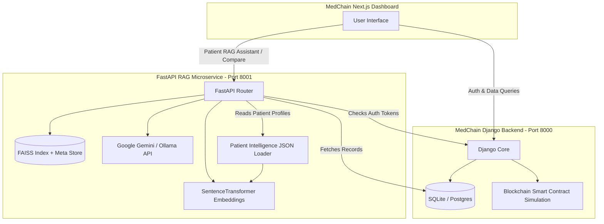

# MedChain: Secure Blockchain & Medical RAG Intelligence System

MedChain is a modern, modular, and secure healthcare intelligence system. It combines a robust **Django + PostgreSQL** REST backend (with cryptographic hashing and blockchain anchoring) with a **FastAPI + FAISS RAG** (Retrieval-Augmented Generation) microservice for patient health records and clinical question answering.

---

## 🏗 System Architecture

MedChain is split into three main modules:
1. **MedChain Backend** (Django & Django REST Framework): Handles user authentication (JWT), clinical data tables, secure medical document uploads, simulated smart contracts/blockchain ledger validation, and permissioned sharing.
2. **MedChain RAG Service** (FastAPI & FAISS): A clinical RAG microservice. It parses clinical databases (Vitals, Diagnoses, Prescriptions) and structured patient intelligence files, indexes them into a local FAISS vector space, and generates secure, grounded answers using Gemini/Ollama.
3. **MedChain Frontend** (Next.js & TailwindCSS): A modern interactive React dashboard for patients and doctors, facilitating uploads, record timelines, secure credential sharing, and real-time conversation with the MedChain AI assistant.



---

## 📁 Repository Structure

```
Medchain01/
├── medchain-server/             # Django Backend Repository
│   ├── medchain_backend/        # Django Project Configuration & Settings
│   ├── clinical/                # Django App: Vitals, diagnoses, and prescriptions
│   ├── records/                 # Django App: Document uploads, SHA-256 generation
│   ├── sharing/                 # Django App: Access request & token sharing
│   ├── users/                   # Django App: Custom user models, JWT authentication
│   ├── db.sqlite3               # Core Database (SQLite)
│   ├── manage.py                # Django CLI tool
│   └── medchain-rag/            # RAG Microservice (FastAPI)
│       ├── api/                 # Pydantic schemas and FastAPI route handlers
│       ├── data/
│       │   └── patients/        # Medically realistic JSON intelligence datasets
│       ├── ingestion/           # Database transformer and patient JSON loader
│       ├── embeddings/          # FAISS index builders
│       ├── llm/                 # Prompt management, Gemini/Ollama runners, question bank
│       ├── retrieval/           # FAISS search query logic
│       ├── tests/               # Pytest test suite (Clinical RAG, DB, LLM, retrieval)
│       ├── main.py              # FastAPI startup script
│       └── requirements.txt     # Python dependencies for the RAG service
```

---

## 🚀 Setup & Local Development

### 1. Database & Django Backend Setup

1. **Navigate to the backend directory**:
   ```bash
   cd medchain-server
   ```
2. **Create and activate a virtual environment**:
   ```bash
   python -m venv venv
   # On Windows (PowerShell)
   .\venv\Scripts\Activate.ps1
   # On macOS/Linux
   source venv/bin/activate
   ```
3. **Install python packages**:
   ```bash
   pip install -r requirements.txt
   ```
4. **Run migrations to set up clinical tables & users**:
   ```bash
   python manage.py makemigrations
   python manage.py migrate
   ```
5. **Boot up the backend**:
   ```bash
   python manage.py runserver 127.0.0.1:8000
   ```

---

### 2. FastAPI RAG Service Setup

1. **Navigate to the RAG directory**:
   ```bash
   cd medchain-server/medchain-rag
   ```
2. **Create and activate a virtual environment**:
   ```bash
   python -m venv venv
   # On Windows (PowerShell)
   .\venv\Scripts\Activate.ps1
   # On macOS/Linux
   source venv/bin/activate
   ```
3. **Install RAG dependencies**:
   ```bash
   pip install -r requirements.txt
   ```
4. **Configure environment files**:
   Create a `.env` file inside `medchain-server/medchain-rag/` using `.env.example` as a template:
   ```env
   # Database path (relative or absolute)
   DB_PATH=../db.sqlite3

   # FAISS storage
   FAISS_INDEX_PATH=./data/faiss.index
   FAISS_META_PATH=./data/faiss_meta.json

   # LLM Config
   LLM_PROVIDER=gemini
   GEMINI_API_KEY=YOUR_API_KEY_HERE
   GEMINI_MODEL=gemini-2.5-flash

   # Token Validation Secret (must match Django's settings.py)
   JWT_SECRET=django-insecure-=368c99s73=ih5%4*mlh1f()0zkovo7#!j2#-j*=%4#3h-iat%
   JWT_ALGORITHM=HS256
   ```
5. **Run the FastAPI server**:
   ```bash
   uvicorn main:app --host 127.0.0.1 --port 8001 --reload
   ```

---

### 3. Frontend Next.js Setup

1. **Navigate to the frontend directory**:
   ```bash
   cd MedchainFrontend
   ```
2. **Install node packages**:
   ```bash
   npm install
   ```
3. **Configure environment**:
   Create a `.env.local` file:
   ```env
   NEXT_PUBLIC_API_URL=http://localhost:8000
   NEXT_PUBLIC_RAG_URL=http://localhost:8001/api/v1
   ```
4. **Run the Next.js development server**:
   ```bash
   npm run dev
   ```

---

## 📊 Patient Intelligence Dataset

The system is shipped with a rich, medically-realistic patient intelligence dataset located in `medchain-rag/data/patients/`. This data allows testing the RAG service immediately on high-complexity clinical workflows.

* **Arjun Deshmukh (P001)**: 36M, Type 2 Diabetes diagnosed on a genetic predisposition timeline. Displays controlled glycemic measurements (HbA1c 6.8%), microvascular checks (retinal scan, nerve conduction study), and metabolic markers.
* **Karan Malhotra (P002)**: 38M, High cardiovascular risk with active smoking history (15 pack-years), hypertension, hyperlipidemia, and a history of an acute coronary syndrome event (NSTEMI) at age 36.

### Vector Ingestion / Reindexing
To load these JSON files (and database clinical tables) into the FAISS index, trigger the indexing pipeline via:
```bash
# HTTP Request
POST http://localhost:8001/api/v1/reindex
Authorization: Bearer <valid_jwt_token>
```
The ingestion process will read the datasets, chunk the descriptions, generate `all-MiniLM-L6-v2` embeddings, and store them locally inside `data/faiss.index`.

---

## 🌐 RAG API Documentation Reference

All RAG requests require an `Authorization: Bearer <token>` header containing a valid user JWT issued by the Django backend.

### 1. `/health` [GET]
* **Purpose**: Health check verifying if the FAISS index is loaded and checking config parameters.
* **Response**:
  ```json
  {
    "status": "ok",
    "index_loaded": true,
    "total_vectors": 337,
    "llm_provider": "gemini",
    "embedding_model": "all-MiniLM-L6-v2"
  }
  ```

### 2. `/reindex` [POST]
* **Purpose**: Reloads all patient intelligence datasets and active clinical database rows, regenerates embeddings, and overwrites the active FAISS index.
* **Response**:
  ```json
  {
    "status": "success",
    "total_chunks": 337,
    "message": "Successfully indexed 337 chunks from 92 documents."
  }
  ```

### 3. `/query` [POST]
* **Purpose**: Runs a patient-scoped medical query. Uses semantic retrieval on the patient's records to fetch context, checks permission scopes, and responds using LLM grounding.
* **Request**:
  ```json
  {
    "query": "Show my active prescription list",
    "top_k": 5
  }
  ```
* **Response**:
  ```json
  {
    "answer": "You are currently prescribed: Metformin 500mg, Atorvastatin 10mg...",
    "sources": [...],
    "query": "Show my active prescription list",
    "answer_mode": "record_grounded",
    "follow_up_questions": ["What diagnoses are in my records?", "What are my recent vitals?"]
  }
  ```

### 4. `/compare` [POST]
* **Purpose**: Runs a cross-patient comparison report. Queries summaries and clinical parameters for two patients and returns a structured analysis. (Admin/Doctor privilege).
* **Request**:
  ```json
  {
    "patient_id_1": "P001",
    "patient_id_2": "P002",
    "aspects": ["risk factors", "medications"]
  }
  ```
* **Response**:
  ```json
  {
    "comparison": "### Patient Comparison Report\n- **Demographics**: Arjun (P001, 36M) vs Karan (P002, 38M)...\n- **Medications**: Metformin & Atorvastatin vs high-intensity Metoprolol & Amlodipine...",
    "patient_1_summary": "Patient P001: 10 context chunks retrieved.",
    "patient_2_summary": "Patient P002: 10 context chunks retrieved.",
    "query": "Compare P001 vs P002"
  }
  ```

---

## 🧪 Testing

To run the verification test suite containing unit tests for database fetching, ingestion, chunking, retrieval, API endpoints, and LLM prompting:

1. Navigate to the RAG service directory:
   ```bash
   cd medchain-server/medchain-rag
   ```
2. Run tests with pytest:
   ```bash
   venv\Scripts\pytest -v
   ```
