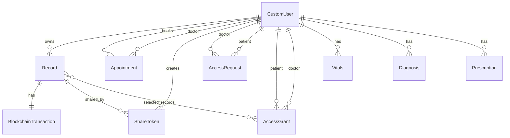

# Database Schema

#database #django #models #postgres #schema

This note documents the current Django data model. The local development guide uses PostgreSQL through Docker, but some RAG code currently reads from a SQLite `DB_PATH`; see [[RAG Service]] and [[Bugs & Production Readiness]].

Related notes: [[System Architecture]], [[Implementation Guide]], [[API Endpoints]], [[Security Model]]

---

## Entity Relationship Overview

---

## `users.CustomUser`

File: `users/models.py`

Purpose:

- Primary identity model.
- Replaces username login with email login.
- Adds patient/doctor role.

Fields:

- `id`: UUID primary key.
- `email`: unique email and `USERNAME_FIELD`.
- `role`: `PATIENT` or `DOCTOR`, default `PATIENT`.
- Standard `AbstractUser` fields still exist, except `username` is removed.

Manager:

- `CustomUserManager.create_user(email, password, **extra_fields)`
- `CustomUserManager.create_superuser(email, password, **extra_fields)`

Production notes:

- Add stronger role assignment rules. Public registration should not freely create privileged roles without policy.
- Consider adding doctor profile/license/specialty verification as a separate model.

---

## `records.Record`

File: `records/models.py`

Purpose:

- Stores patient-owned medical file metadata and cryptographic hash.

Fields:

- `id`: UUID primary key.
- `user`: FK to `AUTH_USER_MODEL`, related name `records`, indexed.
- `record_type`: text category such as lab report or prescription.
- `record_date`: nullable date, indexed.
- `doctor_name`: free-form doctor/source name.
- `file_url`: `FileField(upload_to="uploads/")`.
- `file_hash`: SHA-256 hex digest, max length 64.
- `created_at`: creation timestamp.

Indexes:

- `user`
- `record_date`
- composite index on `user`, `record_date`

Production notes:

- Rename `file_url` to `file` or `storage_key` in a future migration; it currently stores a file, not a URL.
- Store original filename, normalized content type, byte size, scan status, and storage backend key.
- Move file bytes to private object storage.

---

## `blockchain.BlockchainTransaction`

File: `blockchain/models.py`

Purpose:

- Tracks a one-to-one blockchain anchoring attempt for each uploaded record.

Fields:

- `id`: UUID primary key.
- `record`: one-to-one FK to `Record`, related name `blockchain_tx`.
- `tx_hash`: nullable transaction hash string.
- `status`: `PENDING`, `CONFIRMED`, or `FAILED`.
- `created_at`: creation timestamp.
- `updated_at`: update timestamp.

Production notes:

- Add `attempt_count`, `last_error`, `last_attempted_at`, and idempotency fields.
- Replace thread-based submitter with a durable worker.

---

## `sharing.ShareToken`

File: `sharing/models.py`

Purpose:

- Represents an expiring token that can expose either one record or all of a user's records.

Fields:

- `id`: UUID primary key.
- `user`: FK to token creator/patient.
- `token`: unique indexed token from `secrets.token_urlsafe(32)`.
- `record`: optional FK to `Record`; null means full-vault share.
- `expires_at`: defaults to one hour from creation.
- `created_at`: creation timestamp.

Methods:

- `is_valid()`: returns true when current time is before `expires_at`.

Production notes:

- Store a hash of the token instead of the raw token.
- Add revocation fields such as `revoked_at`, `revoked_by`, and `last_accessed_at`.
- Do not log tokens.

---

## `sharing.AccessRequest`

File: `sharing/models.py`

Purpose:

- Represents a doctor requesting access to a patient.

Fields:

- `id`: UUID primary key.
- `doctor`: FK to requester.
- `patient`: FK to target patient.
- `reason`: optional text.
- `status`: `Pending`, `Approved`, or `Declined`.
- `created_at`: creation timestamp.

Production notes:

- Add `updated_at`, `responded_at`, and possibly expiration.
- Enforce doctor/patient roles at model or serializer level.
- Prevent duplicate historical churn through clearer uniqueness rules if needed.

---

## `sharing.AccessGrant`

File: `sharing/models.py`

Purpose:

- Represents active access from a patient to a doctor.

Fields:

- `id`: UUID primary key.
- `patient`: FK to patient.
- `doctor`: FK to doctor.
- `records`: M2M to `Record`, currently unused by read filters.
- `created_at`: creation timestamp.

Constraints:

- `unique_together = ("patient", "doctor")`

Production notes:

- Decide if grants are full-vault or selected-record.
- If selected-record, reads must filter by `records`.
- If full-vault, remove the unused M2M or add explicit `scope`.
- Add `revoked_at` and `expires_at` for lifecycle management.

---

## `appointments.Appointment`

File: `appointments/models.py`

Purpose:

- Stores patient appointment bookings and assignment to doctors.

Fields:

- `id`: UUID primary key.
- `user`: FK to booking patient.
- `doctor`: optional FK to doctor user.
- `doctor_name`: free-form doctor display name.
- `specialty`: free-form specialty.
- `appointment_date`: indexed date.
- `appointment_time`: time.
- `reason`: optional text.
- `status`: string, default `Pending`.
- `created_at`: creation timestamp.

Ordering:

- `appointment_date`, then `appointment_time`.

Production notes:

- Replace free-form doctor selection with required `doctor_id`.
- Convert `status` to enumerated choices.
- Add overlap checks and time-zone policy.

---

## `clinical.Vitals`

File: `clinical/models.py`

Purpose:

- Stores patient vital signs.

Fields:

- `id`: UUID primary key.
- `user`: FK to patient, indexed.
- `recorded_at`: indexed timestamp, default now.
- `weight_kg`: decimal.
- `height_cm`: decimal.
- `blood_pressure_sys`: integer.
- `blood_pressure_dia`: integer.
- `heart_rate_bpm`: integer.
- `temperature_c`: decimal.
- `notes`: text.
- `created_at`: creation timestamp.

Ordering:

- newest `recorded_at` first.

---

## `clinical.Diagnosis`

File: `clinical/models.py`

Purpose:

- Stores patient diagnosis records.

Fields:

- `id`: UUID primary key.
- `user`: FK to patient, indexed.
- `condition_name`: text.
- `icd_code`: optional text.
- `diagnosed_date`: indexed date.
- `status`: `Active` or `Resolved`.
- `severity`: `Mild`, `Moderate`, or `Severe`.
- `notes`: text.
- `created_at`: creation timestamp.

Ordering:

- newest `diagnosed_date` first.

---

## `clinical.Prescription`

File: `clinical/models.py`

Purpose:

- Stores patient medication/prescription data.

Fields:

- `id`: UUID primary key.
- `user`: FK to patient, indexed.
- `medication_name`: text.
- `dosage`: text.
- `frequency`: text.
- `start_date`: date.
- `end_date`: nullable date.
- `refills_remaining`: integer.
- `instructions`: text.
- `created_at`: creation timestamp.

Ordering:

- newest `start_date` first.

---

## Data Integrity Improvements Needed

- Add server-side role constraints for doctor/patient relationships.
- Add explicit grant lifecycle fields.
- Add audit event table.
- Add upload metadata fields.
- Add database-level constraints for appointment statuses and user-role specific relationships where feasible.
- Add migrations to clarify selected-record versus all-record grants.
- Add row-level access patterns in code and tests before introducing real PHI.
