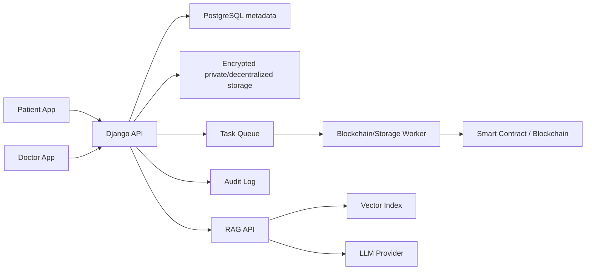

# Project Roadmap & Workflow

#roadmap #workflow #project-plan #blockchain #decentralized #production

This note is the full project plan for turning MedChain from the current MVP backend into a production-grade decentralized patient record platform where patients can securely share records with doctors.

Related notes: [[System Architecture]], [[Bugs & Production Readiness]], [[Security Model]], [[Implementation Guide]], [[RAG Service]], [[Testing Strategy]], [[Deployment Runbook]]

---

## Product Vision

MedChain should let patients own and manage their medical records, prove record integrity with blockchain anchoring, and grant/revoke doctor access in a secure, auditable way.

Core idea:

- Medical files stay off-chain because they are private, large, and expensive to store on-chain.
- File hashes, consent events, access grants, revocations, and audit proofs can be anchored on-chain.
- File bytes should live in encrypted private storage or decentralized encrypted storage.
- Patients should control sharing permissions.
- Doctors should access records only through explicit patient consent.

---

## Current State

Implemented:

- Django backend with users, records, sharing, appointments, clinical models, and simulated blockchain transaction rows.
- Record upload with SHA-256 hash.
- Simulated blockchain confirmation using a background daemon thread.
- Share-token based record access.
- Doctor access request and patient approval flow.
- RAG service for patient question answering.
- Obsidian vault documentation.

Not yet implemented:

- Real blockchain RPC integration.
- Smart contract for consent/access.
- Wallet signing.
- On-chain grant/revoke events.
- Decentralized encrypted storage.
- Production security controls.
- Durable background workers.
- Complete tests and CI.

---

## Target Architecture

Blockchain role:

- Store content hash proofs.
- Store consent grant/revoke events.
- Store immutable audit anchors.
- Optionally store encrypted storage pointers or content identifiers.

Backend role:

- Authenticate users.
- Enforce app-level authorization.
- Manage metadata, UX workflows, and API access.
- Encrypt/decrypt or broker access to encrypted records.
- Synchronize with blockchain events.

---

## Workstreams

### 1. Core Backend

Goal:

- Stabilize Django APIs and data model.

Major tasks:

- Harden settings and secrets.
- Add explicit permission classes.
- Fix access grants and selected-record behavior.
- Replace direct media URLs with permission-checked file access.
- Add audit event model.
- Add tests for auth, records, sharing, and appointments.

### 2. Blockchain and Decentralization

Goal:

- Replace simulated blockchain anchoring with real decentralized integrity and consent.

Major tasks:

- Choose blockchain network for MVP.
- Design smart contract.
- Implement record hash anchoring.
- Implement patient consent grant/revoke events.
- Add wallet connection/signing flow.
- Add backend Web3 service adapter.
- Add blockchain worker queue.
- Add transaction retry and reconciliation.
- Add tests against local blockchain.

### 3. Secure Storage

Goal:

- Store medical records privately and safely.

Options:

- Private S3/GCS/Azure Blob with encryption and signed URLs.
- IPFS/Filecoin with client-side encryption.
- Hybrid: private object storage first, decentralized storage later.

Major tasks:

- Encrypt files before storage or use managed encryption plus app-level access controls.
- Store file hash, storage key/CID, size, content type, and scan status.
- Add malware scanning.
- Add upload limits.
- Add revocation-aware access flow.

### 4. Doctor Sharing Workflow

Goal:

- Make doctor access patient-controlled and auditable.

Major tasks:

- Fix doctor role enforcement.
- Support selected-record grants.
- Add grant expiration/revocation.
- Add patient approval UI contract.
- Add on-chain consent event after approval.
- Add off-chain DB sync for fast reads.
- Add audit trail for every doctor access.

### 5. RAG and Patient Intelligence

Goal:

- Provide safe patient Q&A without leaking data across users.

Major tasks:

- Fix RAG DB connector alignment with Django.
- Lock `/reindex` to admin/service role.
- Disable or secure `/compare`.
- Add patient-scoped vector filtering tests.
- Add PHI-safe logging.
- Add answer evaluation and source faithfulness tests.
- Add incremental reindex after record upload.

### 6. Production Platform

Goal:

- Make deployment reliable, observable, and maintainable.

Major tasks:

- Add CI/CD.
- Add staging environment.
- Add monitoring, logging, tracing, and alerts.
- Add backup/restore workflow.
- Add task queue.
- Add deployment health checks.
- Add runbooks.

---

## Phased Roadmap

## Phase 0: Documentation and Baseline

Status:

- Mostly complete in vault.

Deliverables:

- Architecture documented.
- API endpoints documented.
- Bugs and production readiness documented.
- Roadmap documented.

Exit criteria:

- Team understands current MVP vs target decentralized system.
- Critical gaps are tracked.

---

## Phase 1: MVP Stabilization

Goal:

- Make the current centralized MVP internally consistent and testable.

Tasks:

- Move secrets and debug settings to environment variables.
- Add `IsPatient`, `IsDoctor`, and object-level permission classes.
- Fix `AccessRequestViewSet.create` to require doctor role.
- Decide whether grants are full-vault or selected-record.
- If selected-record, filter doctor reads by granted records.
- Remove raw share tokens from logs.
- Add API throttling.
- Add tests for auth, record access, share tokens, grants, and appointments.

Exit criteria:

- No known cross-user PHI access bugs in Django APIs.
- Critical Django security bugs are fixed.
- CI runs Django tests.

---

## Phase 2: Real File Security

Goal:

- Move away from local unsafe media handling.

Tasks:

- Add private object storage.
- Add upload size limit.
- Add file signature validation.
- Add malware scanning hook.
- Add permission-checked file download endpoint or signed URL flow.
- Add file metadata fields.
- Add audit event on upload/download.

Exit criteria:

- Files are not public.
- Record access always passes through authorization.
- Uploads are validated and auditable.

---

## Phase 3: Blockchain MVP

Goal:

- Replace mock transaction hashes with real blockchain anchoring.

Smart contract MVP:

- `registerRecord(recordId, patientAddress, fileHash, metadataHash)`
- `grantAccess(recordId or scope, patientAddress, doctorAddress, expiresAt)`
- `revokeAccess(grantId)`
- `emit RecordAnchored`
- `emit AccessGranted`
- `emit AccessRevoked`

Backend tasks:

- Add wallet address to user/profile model.
- Add Web3 provider configuration.
- Add contract ABI/address configuration.
- Replace thread with task queue worker.
- Submit record hash after upload.
- Store real transaction hash/status.
- Add retry/reconciliation command.
- Add local blockchain tests with Hardhat, Foundry, or Ganache.

Exit criteria:

- Uploading a record anchors its hash on a local/test blockchain.
- DB stores real tx hash.
- Failed blockchain submissions retry safely.
- Record integrity can be verified against chain state/event logs.

---

## Phase 4: Blockchain-Based Consent

Goal:

- Make patient-to-doctor sharing consent auditable on-chain.

Tasks:

- Add patient wallet signing for grant/revoke.
- Map doctors to verified wallet addresses.
- Emit on-chain grant/revoke events.
- Sync chain events into `AccessGrant`.
- Add grant expiration.
- Add revocation flow.
- Add audit event for every grant and record read.

Exit criteria:

- Doctor access depends on active patient consent.
- Consent changes are anchored on-chain.
- Backend and chain state can be reconciled.

---

## Phase 5: Decentralized/Encrypted Storage

Goal:

- Move toward decentralized patient-owned records while preserving privacy.

Recommended path:

1. Start with private object storage and app-managed access.
2. Add client-side or envelope encryption.
3. Store encrypted content on IPFS/Filecoin or equivalent.
4. Store only hash/CID/metadata proof on-chain.

Tasks:

- Define encryption model.
- Decide key ownership and recovery approach.
- Add encrypted storage adapter.
- Add CID/storage pointer metadata.
- Ensure revocation model is realistic.

Exit criteria:

- Medical files are encrypted outside the application database.
- Chain stores only non-PHI proofs/pointers.
- Access can be granted without exposing raw files publicly.

---

## Phase 6: RAG Production Hardening

Goal:

- Make AI assistant safe, scoped, and auditable.

Tasks:

- Align RAG with production DB or controlled data API.
- Lock reindex to admin/service users.
- Secure or remove compare endpoint.
- Add patient-scoped retrieval tests.
- Add source filtering by patient/grant.
- Add PHI-safe logging.
- Add answer quality and safety evaluation suite.
- Add incremental reindex from record upload events.

Exit criteria:

- RAG cannot leak one patient's data to another.
- All RAG source chunks are authorized.
- Reindexing is controlled and observable.

---

## Phase 7: Production Launch

Goal:

- Deploy safely with monitoring and operational controls.

Tasks:

- Add CI/CD pipeline.
- Add staging environment.
- Add `manage.py check --deploy` gate.
- Add backups and restore tests.
- Add Sentry/OpenTelemetry/log aggregation.
- Add metrics and alerts.
- Add incident runbooks.
- Add load and security testing.

Exit criteria:

- Production checklist in [[Security Model]] is complete.
- Critical/high bugs in [[Bugs & Production Readiness]] are resolved.
- Go-live runbook in [[Deployment Runbook]] is validated.

---

## Recommended Implementation Order

1. Fix security basics: secrets, debug, DB defaults, token logging.
2. Fix access-control bugs: grants, doctor role checks, RAG compare/reindex.
3. Add tests and CI.
4. Move uploads to private storage.
5. Add durable task queue.
6. Implement real blockchain record anchoring.
7. Implement blockchain consent grant/revoke.
8. Add encrypted/decentralized storage.
9. Harden RAG.
10. Prepare production deployment.

---

## Definition of Done for the Full Project

The full project is complete when:

- Patients can upload medical records securely.
- Record hashes are anchored on a real blockchain.
- Patients can grant and revoke doctor access.
- Consent changes are recorded on-chain.
- Doctors can access only authorized records.
- Medical files are encrypted and privately stored.
- Every PHI access is audited.
- RAG answers are scoped to authorized patient data.
- Tests cover critical positive and negative access cases.
- Production deployment has monitoring, backups, and runbooks.
