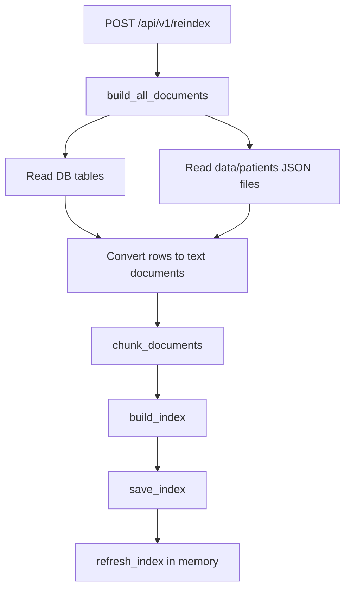
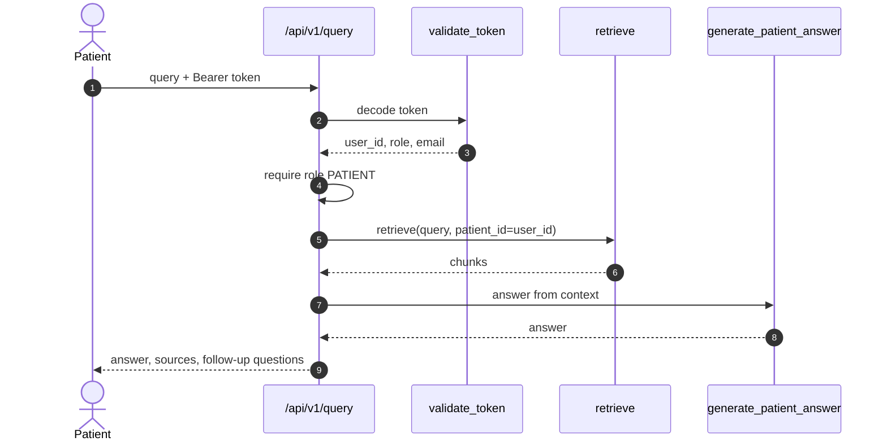

# RAG Service

#rag #fastapi #faiss #llm #patient-data

The RAG service in `medchain-rag` is a separate FastAPI application that indexes patient data and answers patient questions using retrieval-augmented generation.

Related notes: [[System Architecture]], [[API Endpoints]], [[Security Model]], [[Deployment Runbook]], [[Testing Strategy]]

---

## Service Entry Points

Files:

- `medchain-rag/main.py`
- `medchain-rag/api/routes.py`
- `medchain-rag/api/schemas.py`

App:

- FastAPI title: `MedChain RAG API`
- API prefix: `/api/v1`
- Health endpoint: `/api/v1/health`

Startup behavior:

- Attempts to load existing FAISS index.
- Logs warning if no index exists.

---

## Configuration

File:

- `medchain-rag/config.py`

Variables:

- `DB_PATH`: SQLite database path for current connector.
- `FAISS_INDEX_PATH`: FAISS index file path.
- `FAISS_META_PATH`: FAISS metadata JSON path.
- `EMBEDDING_MODEL`: sentence-transformers model.
- `CHUNK_SIZE`: text chunk length.
- `CHUNK_OVERLAP`: overlapping characters.
- `TOP_K`: default retrieval count.
- `LLM_PROVIDER`: `gemini` or `ollama`.
- `GEMINI_API_KEY`
- `GEMINI_MODEL`
- `OLLAMA_URL`
- `OLLAMA_MODEL`
- `JWT_SECRET`
- `JWT_ALGORITHM`
- `CORS_ORIGINS`

Important issue:

- `JWT_SECRET` currently has an insecure fallback.
- `DB_PATH` assumes SQLite while Django local setup uses PostgreSQL.

---

## Indexing Pipeline

Main files:

- `ingestion/transformer.py`
- `ingestion/patient_loader.py`
- `ingestion/chunker.py`
- `embeddings/embedder.py`
- `embeddings/faiss_store.py`

Indexed source types include:

- profile
- record
- appointment
- vital
- diagnosis
- prescription
- parsed_data
- access_grant
- access_request
- patient intelligence JSON source types

Production requirements:

- Reindex must be admin/service-only.
- Reindex should run as a job, not in request/response path.
- Add index locks to prevent concurrent writes.
- Version index builds and support rollback.
- Ensure source text does not include fields that should never be answerable.

---

## Query Pipeline

Security behavior:

- Query endpoint rejects non-patient roles.
- Retrieval is scoped to JWT `user_id`.
- Body `patient_id` exists in schema but query route uses JWT user ID instead.

Production improvements:

- Remove or ignore `patient_id` from schema to avoid confusion.
- Add audit event per query.
- Avoid logging full query text unless logs are PHI-compliant.
- Add per-user rate limits and LLM budget controls.

---

## LLM Providers

Provider selection:

- `LLM_PROVIDER=gemini`
- `LLM_PROVIDER=ollama`

Files:

- `llm/generator.py`
- `llm/question_bank.py`

Production considerations:

- If using external LLM APIs, verify HIPAA/PHI contractual and technical controls.
- Add prompt-injection protections around retrieved records.
- Include medical disclaimer behavior as product policy requires.
- Track model version used for every answer.

---

## Current RAG Risks

Critical:

- `/compare` can retrieve arbitrary patient IDs.
- `/reindex` is not admin-only.
- JWT secret has insecure fallback.

High:

- RAG reads from SQLite by default, while Django uses PostgreSQL in local setup.
- Query logs include the first 60 chars of user query.
- FAISS index is local file state and can be corrupted by concurrent reindex.

Medium:

- Health endpoint exposes configured model names.
- Global exception handler logs exception details.
- Source metadata may reveal sensitive IDs if returned to the wrong caller.

---

## Recommended Production RAG Design

- Use PostgreSQL read replica or service API for source data.
- Enforce authorization before retrieval.
- Partition index by tenant/patient or use metadata filtering with tests.
- Store vector index in a durable managed vector database or controlled persistent volume.
- Queue reindexing and incremental updates.
- Add audit trail for every RAG answer and source access.
- Add offline evaluation tests for hallucination and source faithfulness.
- Add safety policy for medical advice.

---

## RAG Test Checklist

- Patient can query own data.
- Patient cannot query another patient's data.
- Doctor cannot use patient-only query endpoint.
- Doctor can query patient data only if product policy allows and grant is active.
- `/compare` rejects arbitrary IDs until authorization exists.
- `/reindex` rejects non-admin users.
- Missing FAISS index returns safe response.
- LLM failure returns safe client error.
- Source chunks are scoped to the user.
