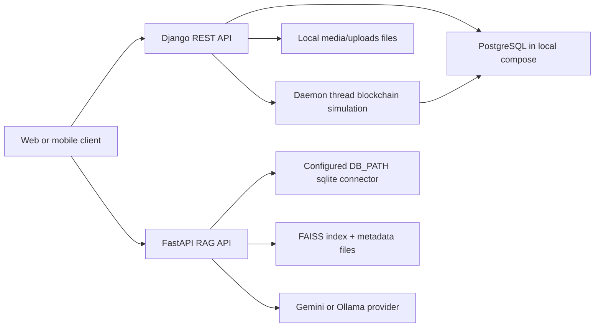
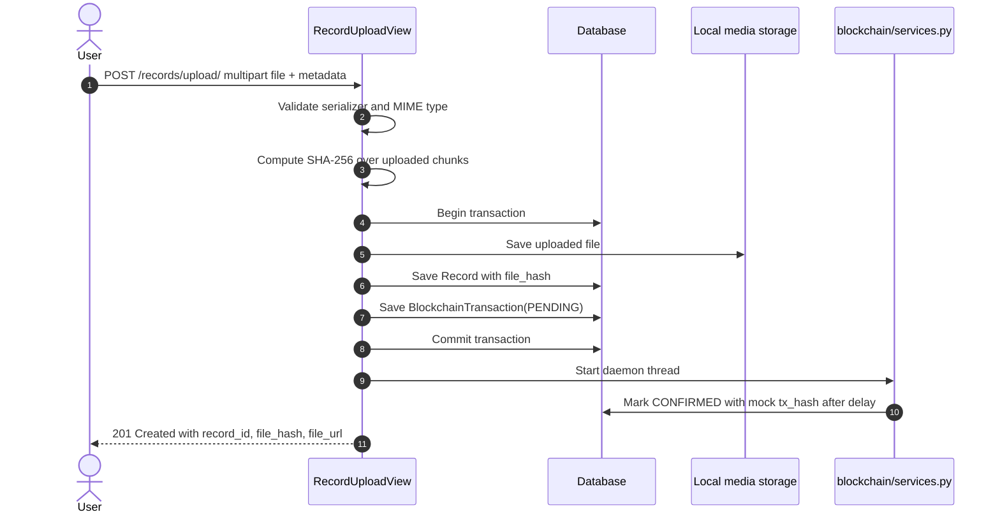
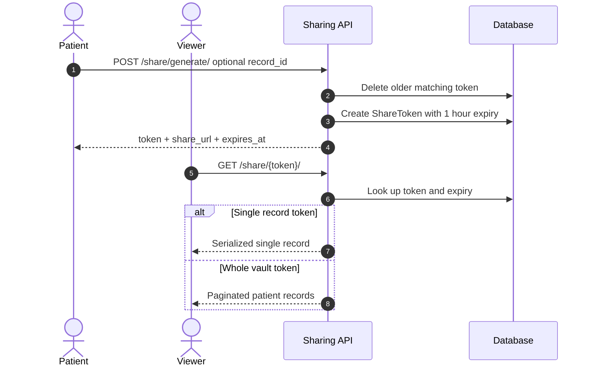
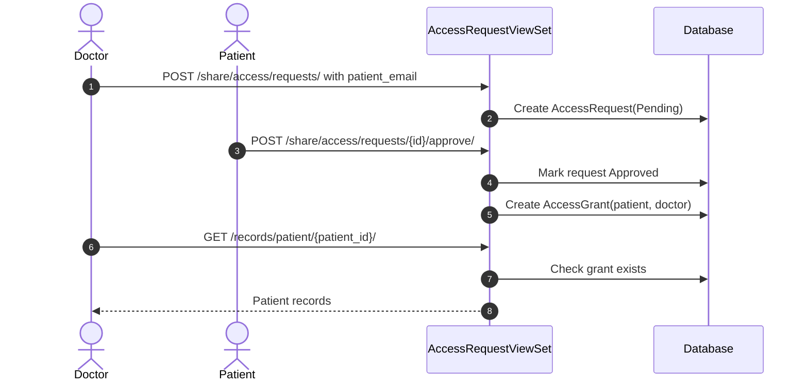
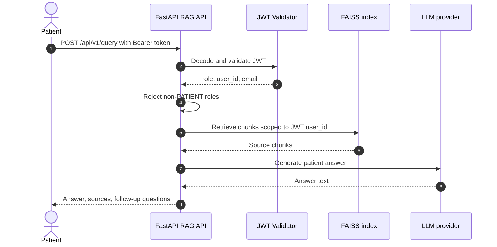
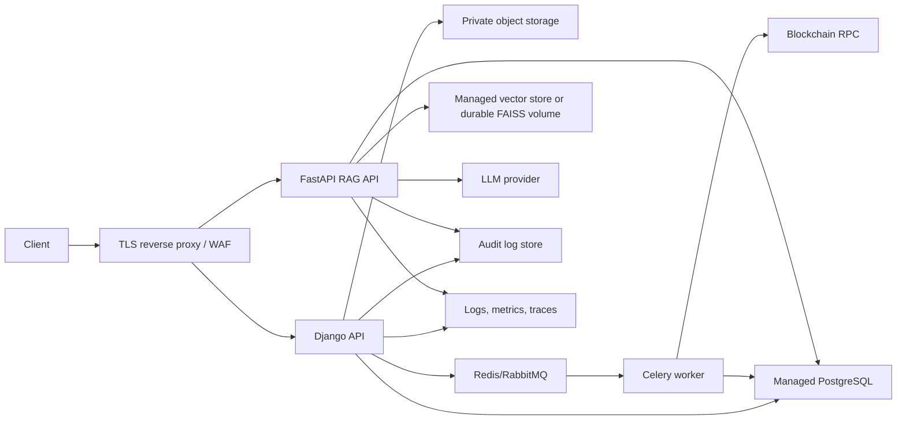

# System Architecture

#architecture #django #fastapi #records #sharing #rag #blockchain

MedChain is a medical record backend made of two cooperating services:

- Django REST API: identity, records, sharing, appointments, clinical data, and simulated blockchain anchoring.
- FastAPI RAG service: retrieval-augmented question answering over patient data and generated/vectorized context.

Related notes: [[Database Schema]], [[API Endpoints]], [[Implementation Guide]], [[RAG Service]], [[Security Model]], [[Bugs & Production Readiness]]

---

## High-Level Components

Current code note: the Django settings target PostgreSQL by default, while the RAG connector currently uses SQLite through `DB_PATH`. That mismatch is a production design gap and should be resolved before the services are deployed together.

---

## Django Service Responsibilities

### `medchain_backend`

- Project settings, base URL routing, middleware, CORS, JWT auth defaults, database configuration, static/media configuration.
- Main route prefixes:
  - `/auth/`
  - `/records/`
  - `/share/`
  - `/appointments/`

### `users`

- UUID-based custom user model.
- Email is the login identifier.
- Roles are `PATIENT` and `DOCTOR`.
- JWT token customization adds role and email claims.
- Google ID token login/registration flow.
- Doctor listing and doctor analytics.

### `records`

- Patient-owned medical file upload and timeline APIs.
- Upload path computes SHA-256 hash from file chunks.
- Creates a `BlockchainTransaction` row in `PENDING` status.
- Starts simulated blockchain anchoring after upload.

### `sharing`

- Expiring public share tokens.
- Doctor-to-patient access requests.
- Patient approval/decline flow.
- Access grants between patients and doctors.

### `appointments`

- Patient appointment booking.
- Doctor assignment is currently inferred from free-form doctor names.
- Doctors and patients can confirm/cancel appointments when authorization checks pass.

### `clinical`

- Structured clinical models for vitals, diagnoses, and prescriptions.
- These are currently model/admin/data-layer objects; no public API routes are wired in the main router yet.

### `blockchain`

- One-to-one transaction metadata for each record.
- Current implementation is a mock async flow using a daemon thread.
- Production target should be a durable job queue plus real chain/RPC integration if blockchain anchoring remains required.

---

## FastAPI RAG Service Responsibilities

The `medchain-rag` folder contains a separate FastAPI service for patient Q&A.

Main responsibilities:

- Validate Django-issued JWTs.
- Load patient/record/clinical/access data into text documents.
- Chunk text documents.
- Create and persist a FAISS vector index.
- Retrieve patient-scoped chunks at query time.
- Generate answers through Gemini or Ollama.
- Provide a question bank and patient comparison endpoint.

Important current gaps:

- `/api/v1/reindex` allows any authenticated user.
- `/api/v1/compare` accepts arbitrary patient IDs without checking ownership/grants.
- JWT secret defaults duplicate the Django hardcoded secret.
- Connector uses SQLite by default, while Django local setup is PostgreSQL.

---

## Core Data Flow: Record Upload

Implementation files:

- `records/views.py`
- `records/serializers.py`
- `records/models.py`
- `blockchain/services.py`
- `blockchain/models.py`

---

## Core Data Flow: Share Token

Implementation files:

- `sharing/models.py`
- `sharing/views.py`
- `sharing/serializers.py`
- `sharing/urls.py`

---

## Core Data Flow: Doctor Grant

Current behavior note: the presence of any grant allows all patient records to be read, even though `AccessGrant.records` implies selected-record sharing. See [[Bugs & Production Readiness]].

---

## Core Data Flow: RAG Query

Implementation files:

- `medchain-rag/api/routes.py`
- `medchain-rag/auth/jwt_validator.py`
- `medchain-rag/ingestion/transformer.py`
- `medchain-rag/embeddings/faiss_store.py`
- `medchain-rag/retrieval/retriever.py`
- `medchain-rag/llm/generator.py`

---

## Production Target Architecture

Production-grade changes:

- Replace local media with private object storage.
- Replace daemon threads with durable task workers.
- Make RAG read from the same production database or from a controlled replica.
- Add audit logging for all PHI access.
- Add role/object-level authorization tests.
- Move secrets to a secret manager.
- Add CI/CD gates before deploy.
